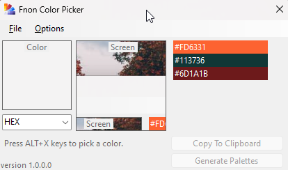
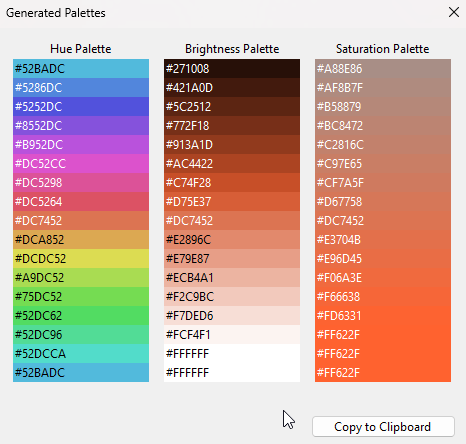

# Fnon Color Picker and Palettes Generator version 1.0.0.1

 Pick a color from your live screen, and choose the color format (Hex, Hexa, Rgb, and Rgba).
 

 Create colors palettes based on the selected color (Hue, Brightness, and Saturation).

 

Made with &#9829; <a href="https://twitter.com/AbuMaxeem">Adel Alawdy</a>

<a href="https://www.buymeacoffee.com/adelalawdy">Buy me a coffee 🍵</a>

